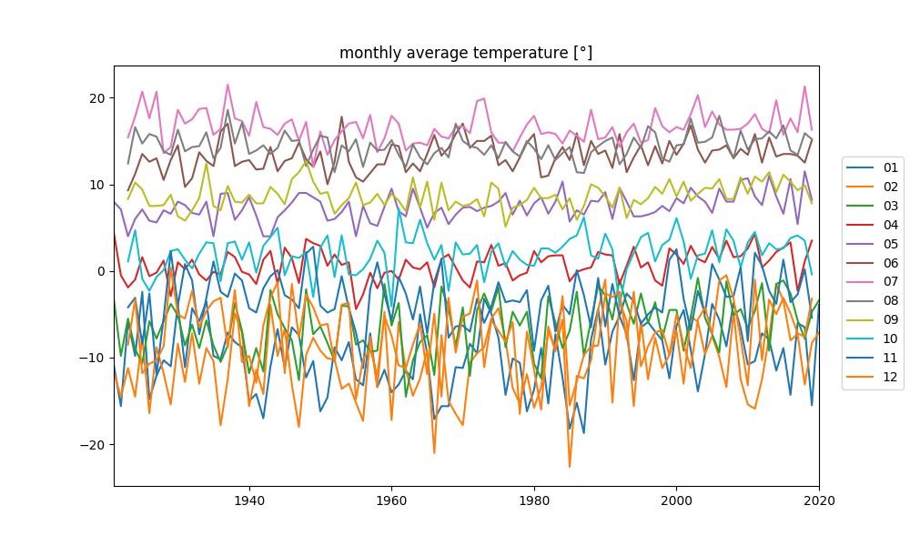
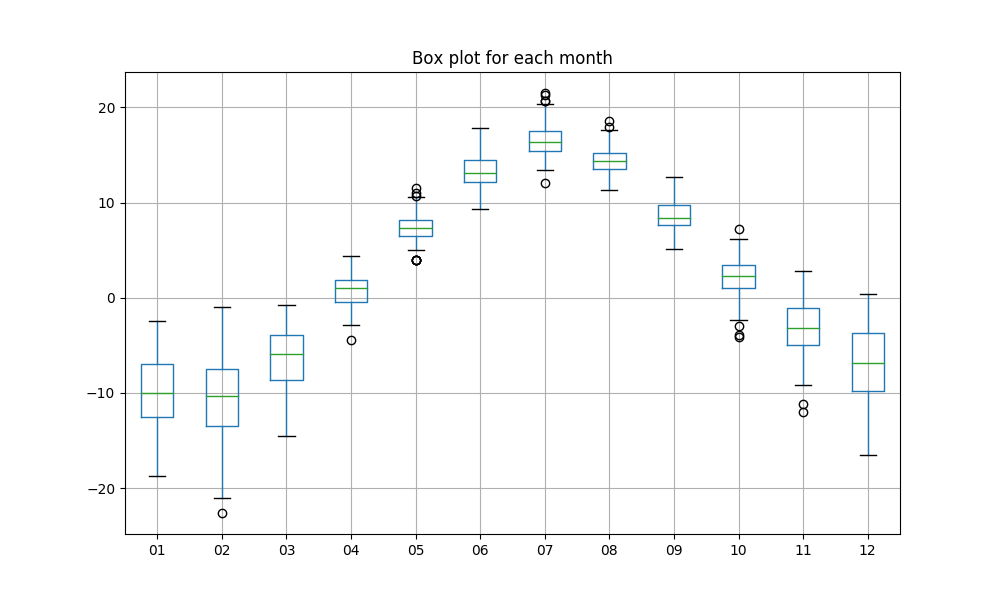
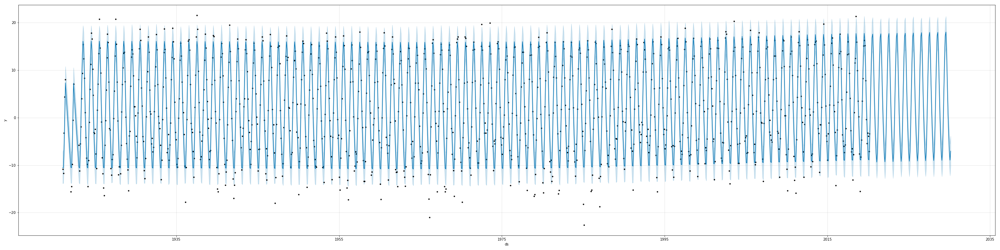
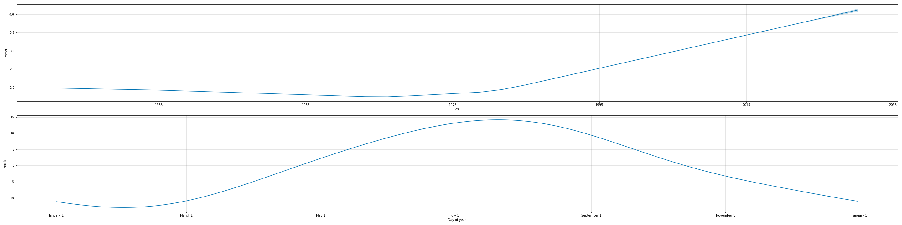
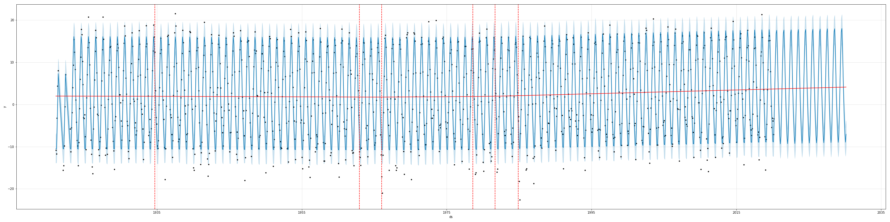
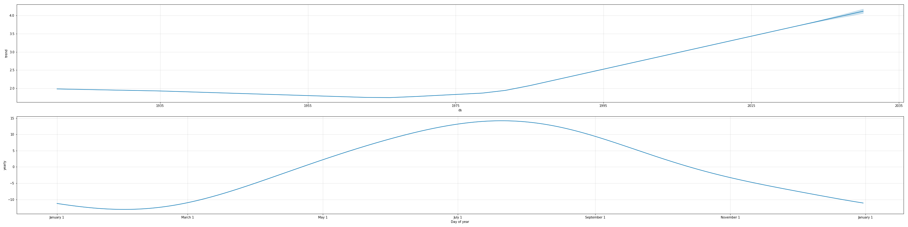
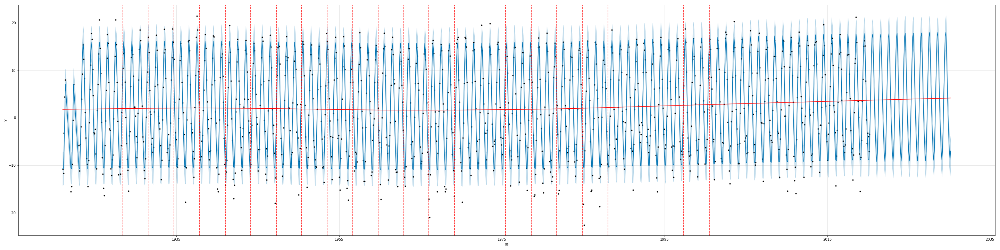
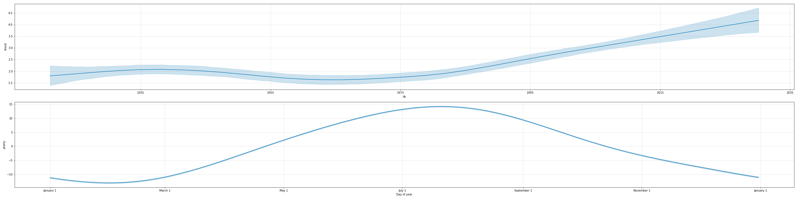

# Using `fbprophet` to analyze monthly average temperature in Luleå since 1921.

Mini-project using time series forecasting tool `fbprophet` to 
fit and predict monthly average temperature in Luleå, Sweden. 

The goal of the project was simply to:
1. Look at the data. Finding any trends?
1. Try `fbprophet`  

Spoiler: It's getting warmer. 

## Dataset

As a teacher, my great-great-gramps let the students measure the temperature
to teach them using averages in math. Since 1921, 4 generations have continued 
to measure the temperature each morning and computing the mean-temp each month.  

As of today, the dataset looks like the following:

|      |    01 |    02 |    03 |   04 |   05 |    06 |    07 |    08 |    09 |    10 |    11 |    12 |
|------|-------|-------|-------|------|------|-------|-------|-------|-------|-------|-------|-------|
| 1921 | -10.8 | -11.7 |  -3.2 |  4.4 |  8   | nan   | nan   | nan   | nan   | nan   | nan   | nan   |
| 1922 | -15.6 | -14.5 |  -9.8 | -0.5 |  7.1 | nan   | nan   | nan   | nan   | nan   | nan   | nan   |
| 1923 |  -5.8 | -11.2 |  -5.5 | -1.9 |  4   |   9.3 |  15.4 |  12.4 |   8.3 |   1.1 |  -4.2 |  -8.5 |
`...` 

|      |    01 |    02 |    03 |   04 |   05 |    06 |    07 |    08 |    09 |    10 |    11 |    12 |
|------|-------|-------|------|-------|-------|-------|-------|-------|-------|-------|-------|-------|
| 2019 | -15.5 |  -8.3 | -4.7 |   3.5 |   8.2 |  15.1 |  16.3 |  15.2 |   7.8 |  -0.4 |  -5.4 |  -3.2 |
| 2020 |  -3.9 |  -7.1 | -3.4 | nan   | nan   | nan   | nan   | nan   | nan   | nan   | nan   | nan   |

Plotting each months data in line plots gives a hint of more spread out distribution during the winter months. 



Looking closer at the distribution of the data for each month using a box plot, it
can clearly be seen that the winter months has greater spread. The seasonality is also
hard to miss here. 



## Method and Disclaimers

First off, using `fbprophet` was both easy and powerful right off the bat. 
I had to alter the options a bit to get a result I was happy with, but
I spent far more time refreshing statistical theory, arranging the data to a 
friendly  format, and fixing plots, than struggling with the implementation. 

Code-wise you'll find the prophet-related code in the `prophet.ipynb` notebook,
whereas `convert_data.py` and `plot_months.py` contains quick and dirty 
helper-functions to convert, plot and print. 

### `fbprophet` - magic?

It uses a decomposable time series modelled with the following components:
```python
y(t) = g(t) + s(t) + h(t) + eps(t)
```
Where `g(t)` is the trend, `s(t)` seasonality, `h(t)` holidays, and `eps(t)` the *idiosyncratic changes which are not
accommodated  by  the  model*. In the section below I'll briefly touch upon
these components in relation to this dataset. 

If you want more info, such as the trend models, read their paper, linked at the bottom.  

### Assumptions  

1. No holidays were applicable. The weather doesn't take easter off. 
One could have maybe added a negative component for Swedish Midsummer as it's
 practically impossible get nice weather. 

1. `fbprophet` uses an automatic seasonality detection based on data. So without 
specifying any arguments, it turned off daily and weekly seasonality when fitting. 
However, it did use too many Fourier components when modelling the yearly seasonality,
so I manually chose 3 instead. However using 1 component gave ish the same result, 
which makes sense both when looking at the boxplot above, but also thinking about 
the northern Swedish yearly seasonalities. Using 3 instead of 1 just felt fancy.  

1. The seasonality mode can be either `additive` (added on top of trend) or 
`multiplicative` (multiplied with the trend component). Out of trying the two, 
`additive` gave fairer results, which aligns with how I think it should be.
  
1. `fbprophet` uses an automatic changepoint detection for the trend. 
By default it uniformly places 25 changepoints in the first 80%
of the data, which it then fits to the data. 
One can suggest specific changepoint-dates based on prior information, but I did not 
add any since what specific date on earth could have changed the local temperature 
[*what*](https://www.svt.se/nyheter/inrikes/facebook-hojer-temperaturen)

1. I did not do any validation of the model, such as dividing the data
into a training and validation dataset and analyzed model differences. 
I basically wasn't into quantitative playing around with the model too much, 
once I found a pretty fit, I was satisfied.     
 
## Result and Discussion 

The plot below show the historic fit and the prediction 10 years into the future.
The dark blue line is the fit, the light blue is the uncertainty estimation
interval, defaulted to 80%. 


Plotting the components, one can see the trend turning slightly positive
in the 60s, while cranking up and keeping the same rising trend since the 80s.
The yearly seasonality looks like a good fit to the data if one looks 
back at the boxplots. 


If this take is correct, that the decomposition related to the original data is 1:1
 on the Y-axis, then the trend shows that the average temperature has risen by 1 degree
 from 1995 to 2015.

### Changepoints

Using a one-liner `add_changepoints_to_plot(fig.gca(), m, fcst)`, one can visualize
the changepoints. 


As mentioned earlier, by default the changepoints are only placed in the first
80% of the data. Using 99% of the interval did not give a different
result. 

### Uncertainty estimation  

The trend uncertainty interval of 80% can barely be seen on the component plots
above. When increasing the interval to 95%, it is easier to see that the uncertainty 
increases for the predicted future. However, the uncertainty is quite small.
As nicely described in the 
[uncertainty estimation docs](https://facebook.github.io/prophet/docs/uncertainty_intervals.html)
the trend uncertainty is based on the average frequency and magnitude of the trend
changes in history. With a steady trend for the last 40 years in this fit, 
the trend uncertainty stays low.   



#### Bayesian sampling

By default `fbprophet` does not include uncertainty estimation of the 
seasonality. To get this one have to do use full Bayesian sampling, MCMC-style. 




However, the seasonality uncertainty is barely noticeable. The trend fluctuates more
with MCMC and the magnitude of the uncertainty follows.  

## Conclusion 
1. The current trend represents 1 degree of warming per 20 years.  
1. `fbprophet` is powerful while easy to use. 
 
## Sources

1. [White Paper](https://peerj.com/preprints/3190/)
1. [fbprophet docs](https://facebook.github.io/prophet/docs/non-daily_data.html#monthly-data)
1. https://towardsdatascience.com/a-quick-start-of-time-series-forecasting-with-a-practical-example-using-fb-prophet-31c4447a2274
1. https://towardsdatascience.com/implementing-facebook-prophet-efficiently-c241305405a3